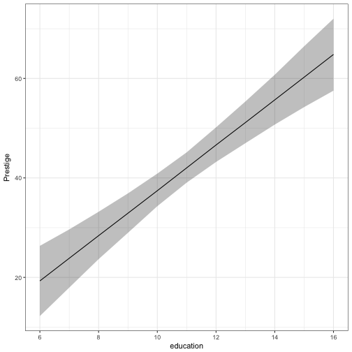

Version: 0.1.0 [](https://travis-ci.org/christophergandrud/coreSim)
[](https://codecov.io/github/christophergandrud/coreSim?branch=master)

> Core functionality for simulating quantities of interest from generalised linear 
models.

## Purpose

Using simulations to find quantities of interest and associated uncertainty
can be an effective way of showing substantively meaningful results from 
generalised linear models (GLM). 

This R package provides core functions that can serve as the backbone to other
packages for finding and plotting simulated quantities of interest from GLMs.

## Steps

1. Estimate your model using whatever GLM model fitting function you like 
(note: I've only tested `lm`, `glm`, and `survival`).

2. Simulate coefficients with `b_sim`.

3. Find your quantities of interest with `qi_builder`.

4. Present your results, e.g. by plotting the simulated quantities of 
interest.

## Example: Normal linear model 

Here is an example using data from the **car** package:


```r
library(coreSim)
library(car)

# Normal linear model
m1 <- lm(prestige ~ education + type, data = Prestige)
# Simulate coefficients
m1_sims <- b_sim(m1)

# Create fitted values
fitted_df_1 <- expand.grid(education = 6:16, typewc = 1)

# Find predicted outcomes (95% central interval, by default)
linear_qi <- qi_builder(b_sims = m1_sims, newdata = fitted_df_1)
```

```
## Note: model argument missing -> assuming normal linear model.
```

```r
head(linear_qi)
```

```
##   education typewc      qi_
## 1         6      1 23.72009
## 2         6      1 18.78262
## 3         6      1 20.72840
## 4         6      1 22.09607
## 5         6      1 13.15539
## 6         6      1 14.51539
```

### Slimmed simulation data

By default `qi_builder` will return all of the simulations inside the central 
interval of the simulations for each scenario that you specify with the `ci` 
argument (this is `0.95` by default for 95% central interval). 

However, you may want to only return key features of this interval so that they
can be efficiently stored and plotted. Using `slim = TRUE` will return only the
minimum, median, and maximum values of the central interval for each scenario:


```r
linear_qi_slim <- qi_builder(b_sims = m1_sims, newdata = fitted_df_1, 
                             slim = TRUE)

head(linear_qi_slim)
```

```
##   education typewc   qi_min qi_median   qi_max
## 1         6      1 12.15064  19.16694 26.76069
## 2         7      1 17.84503  23.71980 30.12726
## 3         8      1 23.39278  28.34454 33.59529
## 4         9      1 28.84553  32.96956 37.04962
## 5        10      1 34.01164  37.55099 41.15894
## 6        11      1 38.83801  42.12270 45.40941
```

The slimmed simulation data set can be efficiently plotted, for example using
[ggplot2](http://docs.ggplot2.org/current/):


```r
library(ggplot2)
theme_set(theme_bw())

ggplot(linear_qi_slim, aes(education, qi_median)) +
    geom_ribbon(aes(ymin = qi_min, ymax = qi_max), alpha = 0.3) +
    geom_line() +
    ylab('Prestige')
```



## Example: Predicted probabilities from logistic regressions

By default `qi_builder` simply returns the linear systematic component, which 
in normal linear regression is simply the predicted y, i.e. 
$y = \alpha + \mathrm{\beta X}$.

`qi_builder` allows you to supply any function for creating quantities of 
interest that you would like. This function needs to simply be able to convert
a vector of linear systematic components to your quantity of interest. 

For example, to find predicted probabilities from a logistic regression model
create a function to turn the systematic component into the QI:


```r
pr_fun <- function(x) 1 / (1 + exp(-x))
```

Then supply it to `qi_builder`'s `model` argument:


```r
# Download data
URL <- 'http://www.ats.ucla.edu/stat/data/binary.csv'
Admission <- read.csv(URL)
Admission$rank <- as.factor(Admission$rank)

# Estimate model
m2 <- glm(admit ~ gre + gpa + rank, data = Admission, family = 'binomial')

# Simulate coefficients
m2_sims <- b_sim(m2)

# Create fitted values
m2_fitted <- expand.grid(gre = seq(220, 800, by = 10), gpa = c(1, 4),
                         rank4 = 1)

# Find quantity of interest
logistic_qi <- qi_builder(m2_sims, m2_fitted, model = pr_fun, slim = TRUE)

head(logistic_qi)
```

```
##   gre gpa rank4      qi_min  qi_median     qi_max
## 1 220   1     1 0.002783753 0.01441787 0.06931141
## 2 230   1     1 0.002893225 0.01484138 0.06995180
## 3 240   1     1 0.002984259 0.01525987 0.07059767
## 4 250   1     1 0.003033161 0.01565690 0.07161055
## 5 260   1     1 0.003122336 0.01605837 0.07303662
## 6 270   1     1 0.003214124 0.01645415 0.07437871
```


## See also

Christopher Gandrud (2015). simPH: An R Package for Illustrating Estimates from
Cox Proportional Hazard Models Including for Interactive and Nonlinear Effects.
Journal of Statistical Software, 65(3), 1-20.
<http://www.jstatsoft.org/v65/i03/>.

Gandrud, Christopher. Laron K. Williams and Guy D. Whitten (2015). dynsim: Dynamic
Simulations of Autoregressive Relationships. R package version 1.2.1.
<https://CRAN.R-project.org/package=dynsim>.

King, Gary, Michael Tomz, and Jason Wittenberg. 2000. "Making the Most of 
Statistical Analyses: Improving Interpretation and Presentation." American 
Journal of Political Science 44(2): 341-55.

